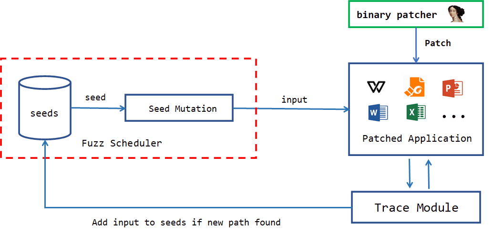

# Introduction
An coverage fuzzer base breakpoint.

Design for large and complex software, which it's too slow if use dbi.

# Used project

https://github.com/hac425xxx/trapfuzzer-gdb

https://github.com/hac425xxx/trapfuzzer-windows-agent

# Reference

https://github.com/FoxHex0ne/Rehepapp